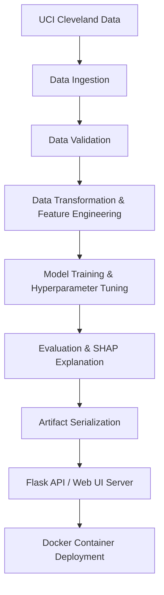

# 🫀 HeartGuard — Explainable Heart Disease Risk Prediction

> **End-to-End Machine Learning Pipeline for Cardiovascular Risk Prediction**


---

## 📌 Executive Summary

**HeartGuard** is a modular, production-ready machine learning framework designed to assess patient cardiovascular disease risk using clinical parameters. Built with an emphasis on **reproducibility**, **explainable AI (XAI)**, and **modular design patterns**, HeartGuard spans the complete ML lifecycle: from automated data ingestion and validation to feature engineering, multi-model evaluation, hyperparameter tuning, SHAP explainability, REST API serving, and Docker containerization.

---

## 🏆 Model Performance Benchmark

All models were evaluated on an independent test set (20% holdout) using 5-fold cross-validation with stratified sampling.

| Model | Accuracy | Precision | Recall | F1-Score | ROC-AUC |
| :--- | :---: | :---: | :---: | :---: | :---: |
| 🌲 **Random Forest Classifier** *(Selected)* | **0.7869** | **0.7568** | **0.8750** | **0.8116** | **0.9334** |
| ⚡ **Support Vector Machine (RBF)** | 0.8197 | 0.8056 | 0.8788 | 0.8406 | 0.9123 |
| 📈 **Logistic Regression (L2)** | 0.8361 | 0.8158 | 0.9118 | 0.8611 | 0.9026 |
| 🚀 **Gradient Boosting Classifier** | 0.8197 | 0.8235 | 0.8485 | 0.8358 | 0.9004 |

> 💡 **Why Random Forest was selected**: While Logistic Regression achieved higher raw accuracy on this split, Random Forest achieved the **highest ROC-AUC (0.9334)** and high Recall (0.8750), minimizing false negatives — a critical priority in medical risk screening.

---

## 🏗️ System Architecture



---

## 📂 Project Directory Structure

```text
Heart Disease ML project/
│
├── .gitignore                      # Tracked exclusions (artifacts, logs, venvs)
├── Dockerfile                      # Multi-stage production container setup
├── README.md                       # Comprehensive project documentation
├── app.py                          # Flask web application & REST API server
├── download_data.py                # Automated dataset retrieval script
├── dvc.yaml                        # DVC pipeline declaration
├── pytest.ini                      # Pytest runner configuration
├── requirements.txt                # Locked Python dependency versions
├── setup.py                        # Package installation manifest
│
├── data/
│   └── raw/
│       └── heart.csv               # Raw Cleveland Heart Disease dataset
│
├── artifacts/                      # Model & preprocessing artifacts (generated)
│   ├── preprocessor.pkl            # Scikit-learn Pipeline transformer
│   ├── model.pkl                   # Trained Random Forest classifier
│   └── plots/                      # Evaluation charts & ROC curves
│
├── notebooks/
│   └── 01_eda.ipynb                # Comprehensive Exploratory Data Analysis
│
├── src/
│   └── heartguard/
│       ├── __init__.py
│       ├── logger.py               # Custom application logging module
│       ├── exception.py            # Custom exception handling class
│       ├── components/
│       │   ├── __init__.py
│       │   ├── data_ingestion.py   # Raw data download & directory setup
│       │   ├── data_validation.py  # Schema enforcement & bounds check
│       │   ├── data_transformation.py # Scaling, Encoding & Feature Engineering
│       │   └── model_trainer.py    # Training, Tuning, Evaluation & SHAP
│       └── pipeline/
│           ├── __init__.py
│           ├── training_pipeline.py# End-to-end orchestration pipeline
│           └── predict_pipeline.py # Inference pipeline & payload builder
│
├── static/
│   ├── css/
│   │   └── style.css              # Custom styling & glassmorphism components
│   └── js/
│       └── main.js                # Form handling, AJAX, & UI interactions
│
├── templates/
│   ├── index.html                 # Primary risk assessment intake form
│   ├── result.html                # Interactive risk report & feature insights
│   └── error.html                 # Exception display page
│
└── tests/
    ├── __init__.py
    ├── test_api.py                # Flask API & endpoint validation tests
    ├── test_data_validation.py    # Schema integrity & missing data tests
    └── test_preprocessing.py      # Feature engineering & immutability tests
```

---

## 🧠 Feature Engineering & Explainability (SHAP)

### Engineered Clinical Features
1. **`age_thalach_ratio`**: `thalach / age` — Ratio of max heart rate achieved during exercise to patient age.
2. **`bp_chol_prod`**: `trestbps * chol` — Combined cardiovascular burden index.
3. **`st_slope_risk`**: `oldpeak * slope` — Composite ischemic stress response.
4. **`risk_score_sum`**: `(cp > 0) + exang + (ca > 0)` — Cumulative clinical risk factors flag.

### SHAP Feature Importance Ranking
HeartGuard integrates **SHAP (SHapley Additive exPlanations)** to provide transparent, interpretable predictions:
1. **Chest Pain Type (`cp`)**: Non-anginal / atypical pain vs asymptomatic presentation.
2. **ST Depression (`oldpeak`)**: Ischemia induced by exercise relative to rest.
3. **Major Vessels Colored (`ca`)**: Number of major blood vessels (0-3) visible under fluoroscopy.
4. **Max Heart Rate (`thalach`)**: Peak heart rate achieved during stress test.

---

## 🚀 Quickstart & Usage

### 1. Clone & Setup Environment

```bash
git clone https://github.com/your-username/HeartGuard.aspx.git
cd "Heart Disease ML project"

# Create virtual environment
python -m venv venv
source venv/bin/activate  # On Windows: venv\Scripts\activate

# Install dependencies
pip install -r requirements.txt
pip install -e .
```

### 2. Download Data & Run ML Pipeline

```bash
# Ingest data
python download_data.py

# Execute full training pipeline
python -m src.heartguard.pipeline.training_pipeline
```

### 3. Run Pytest Suite

```bash
python -m pytest tests/ -v
```

### 4. Launch Web Application

```bash
python app.py
```
Navigate to `http://localhost:5000` in your web browser.

---

## 🌐 API Reference

### Health Check
- **GET** `/health`
- **Response**: `{"status": "healthy", "model_loaded": true}`

### Risk Prediction Endpoint
- **POST** `/predict`
- **Content-Type**: `application/json`

**Sample Request Payload**:
```json
{
  "age": 55,
  "sex": 1,
  "cp": 2,
  "trestbps": 130,
  "chol": 250,
  "fbs": 0,
  "restecg": 1,
  "thalach": 150,
  "exang": 0,
  "oldpeak": 1.2,
  "slope": 1,
  "ca": 0,
  "thal": 2
}
```

**Sample Response**:
```json
{
  "prediction": 1,
  "risk_label": "High Risk",
  "probability_percent": 78.45,
  "risk_level": "High",
  "risk_color": "danger",
  "top_features": [
    {"feature": "Chest Pain Type", "impact": "Positive factor"},
    {"feature": "Max Heart Rate", "impact": "Positive factor"}
  ]
}
```

---

## 🐳 Docker Deployment

Build and launch the application as a standalone container:

```bash
# Build Docker Image
docker build -t heartguard:latest .

# Run Container
docker run -p 5000:5000 heartguard:latest
```

Access the containerized application at `http://localhost:5000`.

---

## 💬 ML Interview Discussion Points

When explaining this project in a machine learning or data science interview, emphasize:

1. **Medical False Negatives vs. False Positives**:
   - In medical diagnosis, **Recall is prioritized over precision** to minimize missed high-risk patients (False Negatives).
   - Random Forest achieved an **ROC-AUC of 0.9334** with **87.5% Recall**.

2. **Modular Architecture & Software Engineering Practices**:
   - Implemented separate components (`ingestion`, `validation`, `transformation`, `training`) with standardized error handling and logging.
   - Comprehensive unit testing suite using `pytest` covering validation, transformation integrity, and API endpoints.

3. **Interpretability & Compliance**:
   - Medical models cannot be black boxes. Used **SHAP tree explainers** to extract exact feature contributions for both global feature importance and individual predictions.

---

## 📄 License & Acknowledgments

- **Dataset**: UCI Machine Learning Repository — Cleveland Heart Disease Dataset.
- **License**: MIT License. free for educational and non-commercial use.
